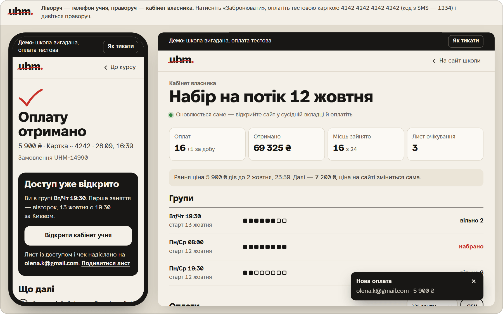
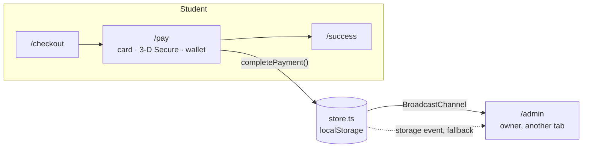

<p align="right">
  <a href="README.md"></a>
  <a href="README.uk.md"></a>
</p>

# uhm.

**A course page that sells, a test checkout, and an owner dashboard that updates live.**

A portfolio demo for a fictional online school of spoken English: the course landing page, plus
everything after someone taps "Book". That means checkout, a test payment page with 3-D Secure,
an email to the student, a student cabinet and the owner's dashboard. The school, people,
reviews and payments are made up, and every page says so. The site is in Ukrainian because it
is built for the Ukrainian market.

**Live → [uhmschool.bodiastorozh.workers.dev](https://uhmschool.bodiastorozh.workers.dev)** ·
both screens at once → [**/demo**](https://uhmschool.bodiastorozh.workers.dev/demo)



[Try it](#try-it-in-a-minute) · [Numbers](#numbers) · [How it works](#how-it-works) ·
[Testing](#testing) · [Make it yours](#make-it-yours)

---

## Try it in a minute

1. Open [**/demo**](https://uhmschool.bodiastorozh.workers.dev/demo) on a laptop. The student's phone is on the
   left and the owner's dashboard is on the right.
2. On the phone, tap **Забронювати** ("Book"), enter any email and phone number, and pay with
   `4242 4242 4242 4242`. The SMS code is `1234`.
3. Watch the right side. A new payment row, the seat counter and the Telegram-bot feed all update
   without a reload.

| Test data | Result |
|---|---|
| `4242 4242 4242 4242` | Payment goes through |
| `4000 0000 0000 0002` | Bank declines it, and the owner sees the failed attempt |
| `1234` | 3-D Secure code |

The **«Як тикати»** ("How to poke it") button in the top bar opens a demo panel. It can close
enrolment, leave a single seat, end the early-bird price in 10 seconds, or reset everything.

| Page | What's there |
|---|---|
| `/` | The course page: offer, groups and seats, early-bird price with a countdown, a Zoom lesson, homework with teacher's corrections, program, teacher, reviews, prices, FAQ |
| `/checkout` | Booking: pick a group and a payment plan (in full, in two parts, or bank instalments). Only two fields |
| `/pay` | Test payment page: card, Apple Pay in Safari or Google Pay elsewhere, 3-D Secure, bank decline |
| `/success` · `/mail` | "Payment received" with instant access, and the email the student gets |
| `/learn` | Student cabinet: start date, checklist, program, payments, a calendar file with every lesson |
| `/admin` | Owner dashboard: groups, payments table with CSV export, waitlist and the Telegram-bot feed, all updating live |

### On a phone


---

## Numbers

| Metric | Value |
|---|---|
| PageSpeed, mobile | **100** |
| JavaScript on the course page | **~30 KB** gzip. The rest of the page is static HTML |
| Fonts | **~96 KB**: three Fixel weights plus Caveat, subset to Latin and Cyrillic |
| Backend | **None.** Replacing one module makes it real |
| Tests | **13** Playwright tests, each run on iPhone WebKit and desktop Chromium |

---

## How it works

### 1. One replaceable module is the whole backend

The demo has to feel like a live system without a server behind it. All state lives in
`localStorage` behind a small store (`src/lib/store.ts`). That covers payments, the waitlist,
bot notifications and demo-panel overrides. Every write is sent to other tabs over
`BroadcastChannel`. A payment made in one tab therefore shows up in the owner's dashboard in
another tab, or in the right-hand frame on `/demo`.



Pages never touch storage directly. They only call `completePayment()`, `failPayment()` and
`joinWaitlist()`. For a real client, only that layer changes:

| In the demo | In production |
|---|---|
| `completePayment()` writes to `localStorage` | A payment provider (WayForPay, LiqPay or monobank) and its webhook |
| `joinWaitlist()` | Google Sheets or a CRM |
| Bot feed on `/admin` | A Telegram bot messaging the owner |
| The `/mail` page | A transactional email service |

### 2. Dates that never go stale

A demo that says "starts 12 October" looks dead by November. `src/lib/schedule.ts` calculates
every date from today in Kyiv. The cohort starts on the first Monday at least 10 days away. The
early-bird price ends on the Friday before that, at 23:59:59 Kyiv time. Dates are stored as
UTC-midnight calendar days, so adding days never breaks on a daylight-saving change. Everyone who
visits on the same day sees the same dates.

The sample data moves with the dates. Fifteen seed payments are spread over the first 11 days
of enrolment, so the owner's dashboard always has data in it, and none of it is in the future.

### 3. Static HTML first, islands only where things move

Astro renders every page to static HTML. Preact hydrates only the interactive parts: the group
picker, countdown, checkout, payment page and the two cabinets. CSS is inlined into the HTML so
there is no render-blocking request. Hashed assets and fonts are cached as `immutable` for a
year.

Each island's first render uses an empty state and the build time (`ssrNow`), which is exactly
what the static HTML contains. Only after that does it read `localStorage` and the real clock.
That means no hydration mismatches and no flash of wrong numbers. The early-bird price switches
at the exact deadline using a single timeout rather than a check every second.

### 4. Forms that forgive typos

Mobile checkouts lose people in the form, so the form does the work for them:

- **Phone.** It accepts `067…`, `+38 (067)…`, `380…` or iOS autofill typed over the mask, and
  normalises all of them to `+380 67 123 45 67` without moving the cursor.
- **Email.** Typos get a one-tap fix. `olena@gmial.com` shows "Did you mean olena@gmail.com?",
  based on edit distance ≤ 2 from common mail domains.
- **Card.** Luhn check, card brand, expiry date. Error messages say what to fix.
- Inputs use a 16 px font so iOS doesn't zoom in, with the right `autocomplete` and `inputmode`.
  Every tap target is at least 44 px.

### 5. A payment page that behaves like a real one

- Apple Pay appears only in Safari on Apple devices. Everyone else gets Google Pay. Both are
  simulated.
- Card payments go through a 3-D Secure SMS step.
- `4000 0000 0000 0002` is declined *after* 3-D Secure, the way a real "insufficient funds" is.
  The student sees a clear message and the owner gets a "payment failed" notification.
- Going back after paying opens the success page, so there is no second charge.

### 6. Small things owners actually use

- **CSV** of payments with a UTF-8 BOM and `;` separators, so Excel opens it with Cyrillic intact
  and no import wizard.
- **`.ics` file** with all 16 lessons in the student cabinet. It works in Google, Apple and Outlook
  calendars.
- **Waitlist** with an "offer a seat" button for when a group fills up.

---

## Testing

Playwright runs against the **production build**, not the dev server. It runs as two projects:
**iPhone 13 on WebKit**, the closest thing to iOS Safari without a device, and **desktop
Chromium**. Locale is `uk-UA` and the time zone is `Europe/Kyiv`.

What the tests pin down:

- **The whole path.** Card payment, then access, then the email, then a new row in the owner's
  dashboard, then one less free seat on the course page.
- **Live sync.** A dashboard open in another tab updates **without a reload**.
- **Bank decline.** No access, no row in the table, and a "payment failed" notification for the
  owner.
- **The form.** Phone mask, email typo fix, `autocomplete` and `inputmode`, 16 px inputs.
- **Full group.** The waitlist, with validation and the visitor's place in the queue.
- **Layout.** No horizontal scroll, and every tap target is at least 44 px.
- **`prefers-reduced-motion`.** The teacher's corrections in the homework show up immediately
  instead of being animated.

```bash
npx playwright install chromium webkit   # once
npm test                                  # build, then both engines
```

---

## Make it yours

The school is config. Adapting it for a real client means editing data, not components:

| What | Where |
|---|---|
| School name, course, prices, groups | `src/config/school.ts` |
| Developer contacts in the footer and demo panel | `src/config/author.ts` |
| Program, reviews, homework | `src/content/program.ts` · `reviews.ts` · `homework.ts` |

<details>
<summary><strong>Local setup and deploy</strong></summary>

<br>

**Requires** Node 22.12+.

```bash
npm install
npm run dev        # http://localhost:4321
npm run build      # static site in dist/
npm run preview    # serve the build
npm run check      # type check
```

**Deploy.** Cloudflare Workers serves it as static assets. Config is in `wrangler.jsonc` and the
Node version is in `.node-version`.

1. Cloudflare → Workers & Pages → Create → Import a repository → `vivrenova/uhmSchool`.
2. Project name `uhmschool`. It must match `name` in `wrangler.jsonc`.
3. Build command `npm run build`, deploy command `npx wrangler deploy`. Both are the defaults.
4. After the first deploy, put the URL in `site` in `astro.config.mjs`.

Every push to `main` deploys automatically. Other branches get their own preview URLs, which is
handy for showing a client alternatives.

Screenshot helpers are in `scripts/`: `shots.mjs`, `flow-shots.mjs`, `states.mjs` and
`overflow.mjs`.

</details>

---

## Credits

Photos are from Unsplash. The people are models and their names and biographies are fictional.
Fonts are [Fixel](https://github.com/MacPaw/Fixel) by MacPaw and
[Caveat](https://github.com/google/fonts/tree/main/ofl/caveat), both under the OFL. Details are in
[CREDITS.md](CREDITS.md).

## Author

Bohdan Storozhuk — [github.com/vivrenova](https://github.com/vivrenova) ·
[bodiastorozh@icloud.com](mailto:bodiastorozh@icloud.com) · [Telegram](https://t.me/vivrenova)
