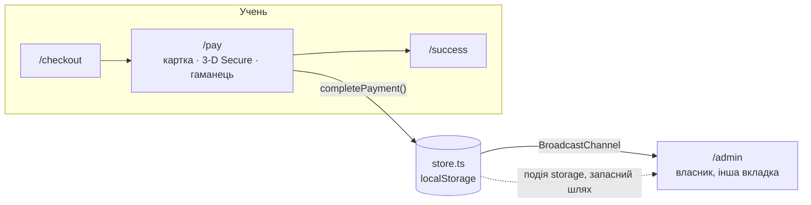

<p align="right">
  <a href="README.md"></a>
  <a href="README.uk.md"></a>
</p>

# uhm.

**Сторінка курсу, що продає, тестова оплата і кабінет власника, який оновлюється наживо.**

Демо для портфоліо: вигадана онлайн-школа розмовної англійської. Тут є сторінка курсу і все, що
відбувається після кнопки «Забронювати»: бронювання, тестова платіжна сторінка з 3-D Secure, лист
учню, кабінет учня й кабінет власника. Школа, люди, відгуки й оплати вигадані, і це чесно написано
на кожній сторінці.

**Живе демо → [uhmschool.bodiastorozh.workers.dev](https://uhmschool.bodiastorozh.workers.dev)** ·
два екрани поруч → [**/demo**](https://uhmschool.bodiastorozh.workers.dev/demo)


[Спробувати](#спробувати-за-хвилину) · [Цифри](#цифри) · [Як це влаштовано](#як-це-влаштовано) ·
[Тести](#тести) · [Під свого клієнта](#під-свого-клієнта)

---

## Спробувати за хвилину

1. Відкрийте [**/demo**](https://uhmschool.bodiastorozh.workers.dev/demo) на ноутбуці. Ліворуч
   телефон учня, праворуч кабінет власника.
2. На телефоні натисніть **«Забронювати»**, введіть будь-який email і телефон та оплатіть карткою
   `4242 4242 4242 4242`. Код з SMS — `1234`.
3. Дивіться праворуч: новий рядок оплати, лічильник місць і стрічка Telegram-бота оновлюються без
   перезавантаження.

| Тестові дані | Результат |
|---|---|
| `4242 4242 4242 4242` | Оплата проходить |
| `4000 0000 0000 0002` | Банк відмовляє, і власник бачить невдалу спробу |
| `1234` | Код 3-D Secure |

Кнопка **«Як тикати»** у верхній плашці відкриває демо-панель. Там можна закрити набір, залишити
одне місце, закінчити ранню ціну через 10 секунд або скинути все.

| Сторінка | Що там |
|---|---|
| `/` | Сторінка курсу: офер, групи й місця, рання ціна з таймером, заняття в Zoom, домашка з правками, програма, викладачка, відгуки, ціни, FAQ |
| `/checkout` | Бронювання: група й спосіб оплати (повністю, двома частинами або частинами від банку). Лише два поля |
| `/pay` | Тестова платіжна сторінка: картка, Apple Pay у Safari або Google Pay деінде, 3-D Secure, відмова банку |
| `/success` · `/mail` | «Оплату отримано» з доступом одразу і лист, який отримує учень |
| `/learn` | Кабінет учня: старт, чекліст, програма, платежі, файл календаря з усіма заняттями |
| `/admin` | Кабінет власника: групи, таблиця оплат з вивантаженням у CSV, лист очікування і стрічка Telegram-бота. Усе оновлюється наживо |

### На телефоні


---

## Цифри

| Показник | Значення |
|---|---|
| PageSpeed, мобільний | **100** |
| JavaScript на сторінці курсу | **~30 КБ** gzip. Решта сторінки — статичний HTML |
| Шрифти | **~96 КБ**: три накреслення Fixel і Caveat, урізані до латиниці й кирилиці |
| Бекенд | **Немає.** Щоб зробити його справжнім, достатньо замінити один модуль |
| Тести | **13** тестів Playwright, кожен ганяється на iPhone (WebKit) і десктопному Chromium |

---

## Як це влаштовано

### 1. Весь бекенд — один модуль, який можна замінити

Демо має відчуватися як жива система, хоча сервера за ним немає. Увесь стан лежить у
`localStorage` за маленьким сховищем (`src/lib/store.ts`): оплати, лист очікування, сповіщення бота
й налаштування демо-панелі. Кожен запис розсилається іншим вкладкам через `BroadcastChannel`. Тому
оплата в одній вкладці одразу з'являється в кабінеті власника в іншій або в правому фреймі на
`/demo`.



Сторінки не працюють зі сховищем напряму. Вони лише викликають `completePayment()`,
`failPayment()` і `joinWaitlist()`. Для справжнього клієнта міняється тільки цей шар:

| У демо | У справжньому проєкті |
|---|---|
| `completePayment()` пише в `localStorage` | Платіжний провайдер (WayForPay, LiqPay або monobank) і його вебхук |
| `joinWaitlist()` | Google Sheets або CRM |
| Стрічка бота на `/admin` | Telegram-бот, який пише власнику |
| Сторінка `/mail` | Сервіс розсилки листів |

### 2. Дати, які не застарівають

Демо з написом «старт 12 жовтня» в листопаді виглядає мертвим. `src/lib/schedule.ts` рахує всі
дати від сьогоднішнього дня за Києвом. Потік стартує в перший понеділок, до якого щонайменше 10
днів. Рання ціна закінчується в п'ятницю перед ним о 23:59:59 за Києвом. Дати зберігаються як
календарні дні (північ за UTC), тож додавання днів не ламається під час переходу на літній чи
зимовий час. Усі, хто заходить в один день, бачать однакові дати.

Стартові дані рухаються разом із датами. П'ятнадцять оплат розкидані по перших 11 днях набору,
тому в кабінеті власника завжди є дані, і жодна з оплат не опиняється в майбутньому.

### 3. Спершу статичний HTML, острови лише там, де щось рухається

Astro збирає кожну сторінку в статичний HTML. Preact оживляє лише інтерактивні частини: вибір
групи, таймер, бронювання, платіжну сторінку і два кабінети. CSS вбудований у HTML, тож немає
окремого запиту, який блокує рендер. Файли з хешем у назві й шрифти кешуються як `immutable` на
рік.

Перший рендер кожного острова використовує порожній стан і час збірки (`ssrNow`), тобто рівно те,
що вже є в статичному HTML. Лише після цього острів читає `localStorage` і справжній годинник.
Тому гідратація ніколи не розходиться і неправильні цифри не блимають. Рання ціна перемикається
точно в момент дедлайну через один таймер, а не через перевірку щосекунди.

### 4. Форми, які прощають помилки

На мобільному найбільше покупців губиться у формі, тож форма робить роботу за них:

- **Телефон.** Приймає `067…`, `+38 (067)…`, `380…` або автозаповнення iOS поверх маски й
  перетворює все це на `+380 67 123 45 67`, не збиваючи курсор.
- **Email.** Одруківки виправляються одним дотиком. На `olena@gmial.com` форма питає «Можливо,
  olena@gmail.com?». Для цього рахується відстань редагування ≤ 2 до популярних поштових доменів.
- **Картка.** Перевірка Луна, платіжна система, термін дії. Помилки кажуть, що саме виправити.
- Поля мають шрифт 16 px, тому iOS не наближає сторінку, і правильні `autocomplete` та
  `inputmode`. Кожна тап-зона щонайменше 44 px.

### 5. Платіжна сторінка поводиться як справжня

- Apple Pay видно лише в Safari на пристроях Apple. Усі інші бачать Google Pay. Обидва
  симульовані.
- Оплата карткою проходить через крок 3-D Secure з кодом з SMS.
- `4000 0000 0000 0002` відхиляється *після* 3-D Secure, як справжня відмова «недостатньо
  коштів». Учень бачить зрозуміле повідомлення, а власник отримує сповіщення «Оплата не пройшла».
- Кнопка «назад» після оплати веде на сторінку успіху, тож повторного списання не буде.

### 6. Дрібниці, якими власники справді користуються

- **CSV** з оплатами з UTF-8 BOM і розділювачем `;`. Excel відкриває його з кирилицею і без
  майстра імпорту.
- **Файл `.ics`** з усіма 16 заняттями в кабінеті учня. Працює в календарях Google, Apple й Outlook.
- **Лист очікування** з кнопкою «запропонувати місце» на випадок, коли група заповнена.

---

## Тести

Playwright ганяє **продакшн-збірку**, а не дев-сервер. Є два проєкти: **iPhone 13 на WebKit**
(найближче до Safari на iOS без справжнього телефона) і **десктопний Chromium**. Локаль `uk-UA`,
часовий пояс `Europe/Kyiv`.

Що закріплено тестами:

- **Увесь шлях.** Оплата карткою, далі доступ, лист, новий рядок у кабінеті власника і на одне
  вільне місце менше на сторінці курсу.
- **Живе оновлення.** Кабінет, відкритий в іншій вкладці, оновлюється **без перезавантаження**.
- **Відмова банку.** Немає доступу, немає рядка в таблиці, а власник отримує сповіщення «Оплата не
  пройшла».
- **Форма.** Маска телефону, виправлення одруківки в email, `autocomplete` та `inputmode`, поля
  16 px.
- **Повна група.** Лист очікування з перевіркою полів і місцем у черзі.
- **Верстка.** Немає горизонтальної прокрутки, кожна тап-зона щонайменше 44 px.
- **`prefers-reduced-motion`.** Правки викладачки в домашці видно одразу, без анімації.

```bash
npx playwright install chromium webkit   # один раз
npm test                                  # збірка, потім обидва рушії
```

---

## Під свого клієнта

Школа — це конфіг. Щоб переробити її під справжнього клієнта, міняються дані, а не компоненти:

| Що | Де |
|---|---|
| Назва школи, курс, ціни, групи | `src/config/school.ts` |
| Контакти розробника у футері й демо-панелі | `src/config/author.ts` |
| Програма, відгуки, домашка | `src/content/program.ts` · `reviews.ts` · `homework.ts` |

<details>
<summary><strong>Локальний запуск і деплой</strong></summary>

<br>

**Потрібно:** Node 22.12+.

```bash
npm install
npm run dev        # http://localhost:4321
npm run build      # статичний сайт у dist/
npm run preview    # перегляд збірки
npm run check      # перевірка типів
```

**Деплой.** Сайт віддається як статичні файли з Cloudflare Workers. Конфіг лежить у
`wrangler.jsonc`, версія Node — у `.node-version`.

1. Cloudflare → Workers & Pages → Create → Import a repository → `vivrenova/uhmSchool`.
2. Project name `uhmschool`. Має збігатися з `name` у `wrangler.jsonc`.
3. Build command `npm run build`, deploy command `npx wrangler deploy`. Обидві стоять за
   замовчуванням.
4. Після першого деплою впишіть адресу в `site` у `astro.config.mjs`.

Кожен пуш у `main` викладається автоматично. Інші гілки отримують власні превʼю-посилання, і це
зручно, щоб показувати клієнтам варіанти.

Допоміжні скрипти для скріншотів лежать у `scripts/`: `shots.mjs`, `flow-shots.mjs`, `states.mjs`
і `overflow.mjs`.

</details>

---

## Подяки

Фото з Unsplash. Люди на них — моделі, а імена й біографії вигадані. Шрифти:
[Fixel](https://github.com/MacPaw/Fixel) від MacPaw і
[Caveat](https://github.com/google/fonts/tree/main/ofl/caveat), обидва під ліцензією OFL.
Подробиці — у [CREDITS.md](CREDITS.md).

## Автор

Богдан Сторожук — [github.com/vivrenova](https://github.com/vivrenova) ·
[bodiastorozh@icloud.com](mailto:bodiastorozh@icloud.com) · [Telegram](https://t.me/vivrenova)
